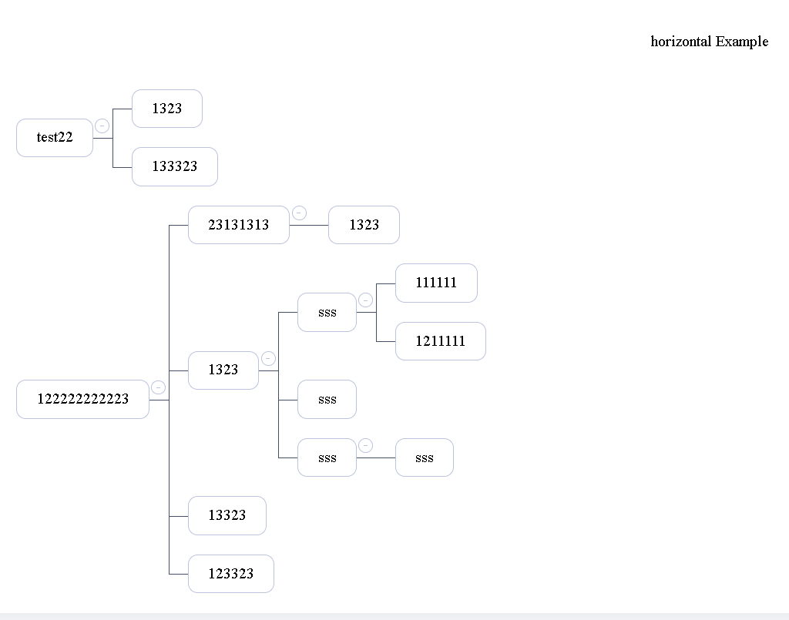

## vue3-diagram-tree
> Vue3图树展示组件,如果需要React版本，请切换分支版本到```react-branch```

<br/>

### 运行效果



### 安装 
```shell
# for Vue 3.x
npm i vue3-diagram-tree
```

### 使用
```js
// global
import vue3DiagramTree from 'vue3-diagram-tree'
app.use(vue3DiagramTree)

// single file
import { VueDiagramTree } from 'vue3-diagram-tree'
export default {
  components: {
    VueDiagramTree
  }
}
```

### 组件属性参考
|参数               |   说明                     |类型                                 | 默认值   |
|----               |   -------                  |------                               | ----     |
|type               |  当前树图以水平/垂直展示   | String(``verticle``/``horizontal``) | verticle |
|treeData           |  treeNodes的数据           | Array<{ id: string, title: string, noExpand: boolean, children: Array: [] }> | [] |verticle |
|layer               |  当前树图展示多少级    | Number | 0(代表全部) |
|enableExpand        |  启用伸缩子节点按钮    | Boolean | false |
|onNodeClick          |  节点点击触发事件      | Function   |

* 注具体使用可查看[Demo目录](https://github.com/JunhoChan/vue3-diagram-tree/blob/main/demo/main.tsx)
